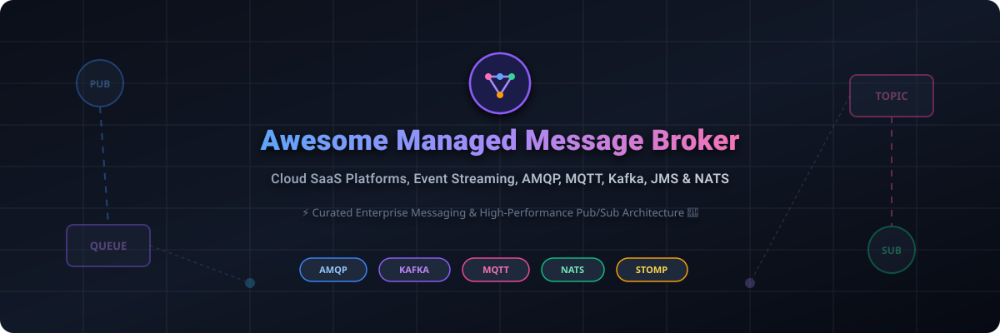

  

# Awesome Managed Message Broker Ecosystem 🚀

  
  
  
  
  
  
  

> 🌟 A curated collection of commercial **managed message broker SaaS platforms**, enterprise **cloud event streaming brokers**, and high-performance **open-source messaging systems** (AMQP, MQTT, Kafka, JMS, STOMP, and NATS).

---

## 📌 Overview & SEO Architecture 🏗️

**Managed Message Brokers** and **Publish/Subscribe (Pub/Sub) messaging infrastructure** are the backbone of modern event-driven architectures ⚡, microservices decoupling 🧩, IoT telemetry processing 📡, and real-time data streaming 🚀. 

This directory categorizes the top commercial cloud-hosted managed broker solutions (Amazon MQ ☁️, CloudAMQP 🐰, Solace PubSub+ 🌐, Aiven 🚀, HiveMQ 🐝) and battle-tested open-source message brokers (Apache Kafka 📊, RabbitMQ 🐇, NATS ⚡, EMQX 📡, Mosquitto 🦟, Apache Pulsar 🌌). Whether you require enterprise SLAs 🛡️, dead-letter queue (DLQ) retry policies 🔄, JMS compliance 🏢, or low-latency MQTT IoT routing 📱, this list provides clear pricing 💰, free tier quotas 🎁, company valuations 📈, and repository star metrics ⭐.

---

## 📚 Table of Contents 📑

- [☁️ SaaS & Hosted Managed Message Brokers](#️-saas--hosted-managed-message-brokers)
  - [📊 Market Analysis & Sector Insight](#-market-analysis--sector-insight)
  - [🗂️ SaaS Comparison Matrix](#️-saas-comparison-matrix)
- [🛠️ Open-Source GitHub Repositories](#️-open-source-github-repositories)
  - [⭐ Top Open-Source Messaging Engines (Sorted by Stars)](#-top-open-source-messaging-engines-sorted-by-stars)
- [⚡ Protocol & Ecosystem Guide](#-protocol--ecosystem-guide-1)
- [🤝 How to Contribute](#-how-to-contribute-1)
- [⚠️ Disclaimer & Security Considerations](#%EF%B8%8F-disclaimer--security-considerations-1)
- [💖 Support & Community](#-support--community)
- [📈 Star History](#-star-history)

---

## ☁️ SaaS & Hosted Managed Message Brokers

### 📊 Market Analysis & Sector Insight

> **💡 Market Insight:** The global managed message broker and pub/sub messaging infrastructure market is valued at approximately **$12.5 Billion+ (2026)** and is projecting a growth rate of ~18.4% CAGR through 2030 📈. The sector is **moderately fragmented**: hyper-scaler cloud vendors (AWS, IBM, Broadcom/Tanzu) dominate general enterprise cloud migrations, while specialized managed broker pioneers (CloudAMQP, Aiven, Solace, HiveMQ, EMQX) capture significant market share in high-throughput streaming, specialized AMQP/MQTT IoT, and multi-cloud event mesh domains.

---

### 🗂️ SaaS Comparison Matrix

*Platforms are sorted descending by **Company Size / Revenue / Valuation** 🏆.*

| Platform / Product | Company Size / Revenue / Valuation 📈 | Starting Price 💵 | Free Tier / Trial Quota 🎁 | Focus & Primary Capabilities 🚀 |
| :--- | :--- | :--- | :--- | :--- |
| **[Amazon MQ](https://aws.amazon.com/amazon-mq/)** ☁️ | **Market Cap:** ~$2.7 Trillion **AWS Revenue:** ~$100B+/yr | **$0.024/hour** per instance (`mq.t3.micro`) + $0.10/GB-month storage | **6-Month Free Tier:** 750 hours/mo of single-instance `mq.t3.micro` + 5GB EFS (ActiveMQ) or 20GB EBS (RabbitMQ) + $200 free credit | Managed ActiveMQ & RabbitMQ natively integrated into AWS IAM, CloudWatch, and VPC architectures. |
| **[RabbitMQ Cloud](https://www.rabbitmq.com/)** 🐇 *(Broadcom / VMware Tanzu)* | **Market Cap:** ~$800 Billion **Broadcom Revenue:** ~$50B/yr | **$0.05/hour** (~$36/month) on Tanzu Cloud / AWS Marketplace | **30-Day Free Trial:** Full enterprise Tanzu Platform trial with dedicated broker instances | Official enterprise RabbitMQ service supporting AMQP, MQTT, STOMP, and custom DLQ policies. |
| **[IBM MQ on Cloud](https://www.ibm.com/products/mq)** 🏢 | **Market Cap:** ~$250 Billion **IBM Revenue:** ~$67.5B/yr | **$0.091/hour** per VPC (~$67/month); Reserved SaaS from $727/month | **Lite Free Plan:** Free up to 10,000 messages/month; 30-day trial credit on IBM Cloud | Enterprise-grade message queuing with transactional JMS, point-to-point routing, and strict security compliance. |
| **[Aiven for Apache Kafka](https://aiven.io/kafka)** 🚀 | **Valuation:** ~$3.0–$3.2 Billion **ARR:** ~$100M+ | **$0.15/hour** (~$35–$40/month) Developer Plan | **$300 Free Trial Credit:** Valid for 30 days + Always-Free Tiers for PostgreSQL/MySQL/OpenSearch | Managed Kafka across AWS, GCP, Azure, and DigitalOcean with Terraform provider automation. |
| **[Solace PubSub+ Cloud](https://solace.com/)** 🌐 | **Valuation:** ~$352 Million **ARR:** ~$100.3M | **$0.46/hour** (~$330/month) for dedicated standard brokers | **15-Day Free Trial:** Full Event Mesh access + Free software broker tier (100 conn, 100 msg/sec, 2GB storage) | Multi-protocol enterprise event broker supporting Event Mesh, JMS, AMQP, MQTT, REST, and WebSockets. |
| **[HiveMQ Cloud](https://www.hivemq.com/)** 🐝 | **Valuation:** ~$200 Million **ARR:** ~$60M | **$1.50/hour** or **$0.35/GB** for Serverless overages; Starter from $75/month | **Free Forever Serverless:** 100 concurrent MQTT connections + 10GB data storage/mo; 15-day trial for Starter | Enterprise-grade managed MQTT broker engineered for large-scale IoT fleet communication. |
| **[CloudAMQP](https://www.cloudamqp.com/)** 🐰 | **Valuation:** ~$100 Million **ARR:** ~$20M *(84codes AB)* | **$19/month** Shared plan ("Tough Tiger"); Dedicated single-node from $50/month | **Little Lemur Free Plan:** 1,000,000 messages/month, 1,000 max connections, shared cluster free forever | Premier managed RabbitMQ and LavinMQ service on AWS, Azure, GCP, DigitalOcean, and Heroku. |
| **[EMQX Cloud](https://www.emqx.com/)** ⚡ | **Total Funding:** ~$23 Million **ARR:** ~$10M–$20M *(EMQ)* | **$0.15/million messages** Serverless; Dedicated Flex clusters from $234/month | **Free Forever Serverless:** 1,000,000 messages/month + 100 connections; 14-day trial on Dedicated Flex | Cloud-native MQTT broker scalable up to 100 Million+ concurrent connected IoT devices. |
| **[Anynines RabbitMQ](https://www.anynines.com/)** 🇪🇺 | **Valuation:** ~$25 Million **Revenue:** ~$5M–$10M *(anynines GmbH)* | **€20/month** (~$22/month) Hosted single node | **30-Day Free Trial:** Dedicated 1GB RAM test instance in European data centers | European managed RabbitMQ broker offering strict GDPR compliance and automated cluster operations. |

---

## 🛠️ Open-Source GitHub Repositories

### ⭐ Top Open-Source Messaging Engines (Sorted by Stars)

*All repositories below are sorted descending by GitHub stargazers. Click any star badge to visit the official stargazers directory.*

1. **[Redis](https://github.com/redis/redis)** 🔴 
   - **Stars:** ~76,600+ ⭐ | **License:** BSD-3-Clause / RSALv2 / SSPLv1 📜
   - **Overview:** Ultra-fast in-memory data store providing lightweight Pub/Sub channels and consumer group log streaming via Redis Streams.
   - **Best For:** Ultra-low latency transient messaging and simple work queues.

2. **[Apache Kafka](https://github.com/apache/kafka)** 📊 
   - **Stars:** ~33,900+ ⭐ | **License:** Apache-2.0 📜
   - **Overview:** The industry standard distributed event streaming platform offering partitioned, fault-tolerant, high-throughput pub/sub log storage.
   - **Best For:** High-volume event streaming, real-time analytics pipelines, and event-driven microservices.

3. **[Dapr](https://github.com/dapr/dapr)** 🧩 
   - **Stars:** ~26,100+ ⭐ | **License:** Apache-2.0 📜
   - **Overview:** Portable runtime for building distributed applications, offering standardized Pub/Sub building blocks across cloud and edge.
   - **Best For:** Cloud-native microservices requiring broker-agnostic messaging abstractions.

4. **[NSQ](https://github.com/nsqio/nsq)** ⚡ 
   - **Stars:** ~25,700+ ⭐ | **License:** MIT 📜
   - **Overview:** Real-time distributed messaging platform designed to operate at scale without single points of failure.
   - **Best For:** High-volume distributed log processing and lightweight Go pipelines.

5. **[Apache RocketMQ](https://github.com/apache/rocketmq)** 🚀 
   - **Stars:** ~22,600+ ⭐ | **License:** Apache-2.0 📜
   - **Overview:** Distributed messaging and streaming data platform optimized for low latency, financial-grade reliability, and high throughput.
   - **Best For:** Transactional messaging, delayed queueing, and e-commerce message backbone.

6. **[NATS Server](https://github.com/nats-io/nats-server)** ⚡ 
   - **Stars:** ~20,800+ ⭐ | **License:** Apache-2.0 📜
   - **Overview:** High-performance cloud-native messaging system supporting lightweight Pub/Sub, Request-Reply, and JetStream persistent streaming.
   - **Best For:** Cloud-native microservices, Kubernetes edge computing, and low-footprint pub/sub.

7. **[EMQX](https://github.com/emqx/emqx)** 📡 
   - **Stars:** ~16,700+ ⭐ | **License:** Apache-2.0 📜
   - **Overview:** Massively scalable, distributed Erlang/Elixir MQTT broker capable of supporting 100M+ concurrent IoT connections.
   - **Best For:** Enterprise IoT device telemetry, connected vehicles, and industrial IIoT.

8. **[Apache Pulsar](https://github.com/apache/pulsar)** 🌌 
   - **Stars:** ~15,300+ ⭐ | **License:** Apache-2.0 📜
   - **Overview:** Distributed pub/sub messaging and streaming platform featuring multi-tenancy, tiered storage, geo-replication, and separated compute/storage architecture.
   - **Best For:** Multi-tenant enterprise streaming, cloud-native message queuing, and geo-replicated topics.

9. **[RabbitMQ Server](https://github.com/rabbitmq/rabbitmq-server)** 🐇 
   - **Stars:** ~13,900+ ⭐ | **License:** MPL-2.0 📜
   - **Overview:** The world's most widely deployed open-source message broker supporting AMQP 0-9-1, AMQP 1.0, MQTT, STOMP, Dead Letter Exchanges (DLX), and flexible exchange routing.
   - **Best For:** Complex queue routing, DLQ error handling policies, enterprise work queues, and multi-protocol integration.

10. **[Redpanda](https://github.com/redpanda-data/redpanda)** 🐼 
    - **Stars:** ~12,600+ ⭐ | **License:** BSL 📜
    - **Overview:** C++ Kafka-API compatible streaming platform designed for low latency without JVM dependencies or ZooKeeper overhead.
    - **Best For:** High-performance Kafka drop-in replacements with low memory footprint.

11. **[Eclipse Mosquitto](https://github.com/eclipse-mosquitto/mosquitto)** 🦟 
    - **Stars:** ~11,200+ ⭐ | **License:** EPL-2.0 / EDL-1.0 📜
    - **Overview:** Lightweight open-source C implementation of an MQTT broker supporting MQTT v5.0, v3.1.1, and v3.1.
    - **Best For:** Resource-constrained single-board computers, embedded IoT devices, and local gateways.

12. **[ZeroMQ (libzmq)](https://github.com/zeromq/libzmq)** 🔌 
    - **Stars:** ~11,000+ ⭐ | **License:** MPL-2.0 📜
    - **Overview:** High-performance asynchronous messaging library carrying messages across inproc, IPC, TCP, TPIC, and multicast without a centralized broker daemon.
    - **Best For:** Brokerless high-speed socket communication and custom peer-to-peer protocols.

13. **[Watermill](https://github.com/ThreeDotsLabs/watermill)** 🌊 
    - **Stars:** ~9,900+ ⭐ | **License:** MIT 📜
    - **Overview:** Go library for working efficiently with message streams, event sourcing, CQRS, and pub/sub background drivers.
    - **Best For:** Building event-driven Go microservices and pub/sub abstractions.

14. **[Beanstalkd](https://github.com/beanstalkd/beanstalkd)** 🫘 
    - **Stars:** ~6,700+ ⭐ | **License:** MIT 📜
    - **Overview:** Fast, lightweight, general-purpose work queue protocol designed for background job processing.
    - **Best For:** Asynchronous background job queueing with priority and delay timers.

15. **[Apache Camel](https://github.com/apache/camel)** 🐫 
    - **Stars:** ~6,300+ ⭐ | **License:** Apache-2.0 📜
    - **Overview:** Versatile open-source integration framework providing enterprise integration patterns (EIPs) and 350+ messaging connectors.
    - **Best For:** Complex enterprise message routing, transformation, and protocol bridging.

16. **[VerneMQ](https://github.com/vernemq/vernemq)** 🚀 
    - **Stars:** ~3,600+ ⭐ | **License:** Apache-2.0 📜
    - **Overview:** High-performance, distributed Erlang MQTT message broker designed for high availability and clustering.
    - **Best For:** Clustered MQTT infrastructure requiring reliable message distribution.

17. **[Liftbridge](https://github.com/liftbridge-io/liftbridge)** 🌉 
    - **Stars:** ~2,800+ ⭐ | **License:** Apache-2.0 📜
    - **Overview:** Lightweight Kafka-style message streaming server built on top of NATS without JVM or ZooKeeper requirements.
    - **Best For:** Simple Go-native stream storage extending NATS Pub/Sub.

18. **[NanoMQ](https://github.com/nanomq/nanomq)** 📱 
    - **Stars:** ~2,600+ ⭐ | **License:** MIT 📜
    - **Overview:** Ultra-lightweight and blazing-fast C-based MQTT broker optimized for Edge computing and Software-Defined Vehicles (SDV).
    - **Best For:** Edge gateways, automotive compute boards, and embedded Linux devices.

19. **[Apache ActiveMQ](https://github.com/apache/activemq)** 🏢 
    - **Stars:** ~2,400+ ⭐ | **License:** Apache-2.0 📜
    - **Overview:** The classic open-source multi-protocol message broker supporting JMS 1.1, AMQP, MQTT, STOMP, and OpenWire.
    - **Best For:** Legacy Java enterprise applications and JMS queuing.

20. **[HiveMQ Community Edition](https://github.com/hivemq/hivemq-community-edition)** 🐝 
    - **Stars:** ~1,200+ ⭐ | **License:** Apache-2.0 📜
    - **Overview:** Open-source Java-based MQTT broker fully compliant with MQTT v3.x and MQTT v5 specifications.
    - **Best For:** Open-source IoT messaging based on Java architecture.

21. **[Apache ActiveMQ Artemis](https://github.com/apache/activemq-artemis)** 🏹 
    - **Stars:** ~1,000+ ⭐ | **License:** Apache-2.0 📜
    - **Overview:** High-performance asynchronous non-blocking message broker offering full JMS 2.0 and Jakarta Messaging support.
    - **Best For:** Modern high-throughput Java messaging workloads.

22. **[LavinMQ](https://github.com/cloudamqp/lavinmq)** 💎 
    - **Stars:** ~1,000+ ⭐ | **License:** Apache-2.0 📜
    - **Overview:** Extremely fast AMQP 0-9-1 message broker written in Crystal, achieving high message throughput with low hardware consumption.
    - **Best For:** Resource-efficient RabbitMQ protocol replacement.

23. **[KubeMQ Community](https://github.com/kubemq-io/kubemq-community)** ☸️ 
    - **Stars:** ~660+ ⭐ | **License:** Apache-2.0 📜
    - **Overview:** Kubernetes-native message broker and message queue container designed for containerized cloud deployment.
    - **Best For:** Kubernetes-native event-driven architectures.

24. **[Apache Qpid Broker-J](https://github.com/apache/qpid-broker-j)** ☕ 
    - **Stars:** ~70+ ⭐ | **License:** Apache-2.0 📜
    - **Overview:** Pure Java message broker supporting AMQP 1.0, 0-10, 0-9-1, 0-9, and 0-8 protocol standards.
    - **Best For:** Strict AMQP protocol compliance and Java environments.

---

## ⚡ Protocol & Ecosystem Guide 💡

Selecting the right managed broker depends on your application's protocol requirements and operational constraints:

- 🐰 **AMQP (Advanced Message Queuing Protocol):** Choose **RabbitMQ**, **CloudAMQP**, or **LavinMQ** when complex topic exchange routing, dead-letter queue (DLQ) retry workflows, and high message durability are needed.
- 🚀 **Event Streaming (Kafka API):** Choose **Apache Kafka**, **Aiven**, **Redpanda**, or **Apache Pulsar** when building high-throughput append-only event logs, stream processing, or event sourcing.
- 📡 **MQTT (Message Queuing Telemetry Transport):** Choose **EMQX**, **Mosquitto**, **HiveMQ**, or **NanoMQ** for low-power, constrained bandwidth IoT telemetry and edge-to-cloud device connectivity.
- 🏢 **JMS / Enterprise Queuing:** Choose **Amazon MQ**, **IBM MQ**, **Solace PubSub+**, or **ActiveMQ Artemis** for legacy application migration, transactional guarantees, and Java ecosystem compatibility.
- ⚡ **Cloud-Native & Lightweight Pub/Sub:** Choose **NATS** or **NSQ** for ultra-fast microservices communication with minimal configuration complexity.

---

## 🤝 How to Contribute 📑

Contributions from the developer and cloud architecture community are very welcome! To submit a new managed message broker SaaS platform or open-source repository:

1. 🍴 **Fork** this repository.
2. 📝 Update `README.md` with accurate entries following the table or list schema.
3. 💵 For SaaS entries, verify starting prices, free tier limits, and company revenue/valuation data.
4. ⭐ For Open-Source entries, include the GitHub stargazers social badge linked to `/stargazers` and maintain descending star count order.
5. 📬 Submit a **Pull Request** with a concise summary.

---

## ⚠️ Disclaimer & Security Considerations 🛡️

- 🌐 **Community Maintained:** This repository is a community-curated collection intended for educational and architectural reference.
- 🔄 **Dead Letter Queue (DLQ) Hardening:** Always configure explicit Dead-Letter Queues (DLQ), TTL, and max-retry thresholds on production message queues to avoid silent message drops or unhandled message loops.
- 🔒 **Production Operational Security:** Managed SaaS brokers provide built-in SSL/TLS encryption, VPC peering, and high-availability SLAs. For self-hosted open-source options, ensure proper authentication, access control lists (ACLs), monitoring, and automated backup strategies are implemented.

---

## 💖 Support & Community ☕

If you found this curated list helpful, please consider supporting the project:
- ⭐ **Star** this repository on GitHub to help others discover it.
- 🍴 **Fork** it to keep your own copy and contribute improvements.
- 📢 **Share** it with your engineering team, cloud architects, and friends!
- ☕ **Buy Me a Coffee / Sponsor**: Support ongoing maintenance on the [GitHub Sponsor Dashboard](https://github.com/sponsors/ishandutta2007).

  

---

## 📈 Star History

---

  <b>Built with ❤️ for backend engineers, cloud architects, and platform teams building resilient event-driven systems.</b>

